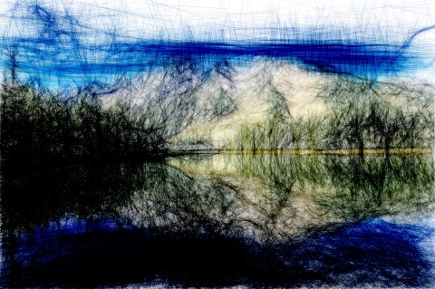

# Tensor Directed Stylization
*BERTHET Vincent*

*QUERO Benoit*
## Introduction 
This project rely on "Tensors-directed simulation of strokes for image stylization with hatching and contours" 
*- David TSCHUMPERLE in September 2011*

Its describe an algorithm to generate sketches from color images directed by an image-dependent tensor-valued geometry

|  |  |   |
|:-:|:-:|:-:|
|   |  |   |
## Environment configuration (Conda)
### Import environment
You can directly use exported environment in `./conda/` by running the following command `conda env create -f conda/win.yml` 

*(\*.yml prefix path value should be edit for your device)*
### Packages
The previous environment contains the following packages :

[OpenCV](https://anaconda.org/conda-forge/opencv)  
`conda install -c conda-forge opencv`

[SciPy](https://anaconda.org/conda-forge/scipy)  
`conda install -c conda-forge scipy `

[Progressbar2](https://anaconda.org/conda-forge/progressbar2)  
`conda install -c conda-forge progressbar2 `

[Blend modes](https://anaconda.org/conda-forge/blend_modes)  
`conda install -c conda-forge blend_modes `

## Scripts
[naive.py](./scripts/naive.py) naive approach of the algorithm

[tensors.py](./scripts/tensors.py) main script to run the algorithm and use tensors approach for an input image. Arguments that can be used are the following :
- **-i,--image :** path of input image
- **-s1,--sigma1 :** set sigma 1 for gaussian gaussian blur 1
- **-s2, --sigma2 :** set sigma 2 for gaussian blur 2
- **-p1, --power1 :** power 1 to change tensors
- **-p2, --power2 :** power 2 to change tensors
- **-n, --number :** number of strokes on the sketch
- **-e, --epsilon :** epsilon to draw strokes
- **-l, --length :** length of strokes
- **-c, --coefficient :** ratio to reduce the input image
- **-o, --output :** custom output under ./output/tensors directory

[tensorsTools.py](./scripts/tensorsTools.py) toolbox for rendering, class structure,  used by tensors script

[generate.py](./scripts/generate.py) use to generate a lot of image using tensors approach by setting some different parameters of tensors script

`python ./scripts/tensors.py -i ./sources/lena.png`
## Results
### Naive approach
|  |  |  |
|:-:|:-:|:-:|
|Source| Gray| Mulitply|

|  |  |  |
|:-:|:-:|:-:|
|Source| Gray| Mulitply and Gaussain blur|

### Tensors approach

|  |  |  |
|:-:|:-:|:-:|
|Source| Sketch 1 | Sketch 2|

|  |  |  |
|:-:|:-:|:-:|
|Source| Sketch 1 | Sketch 2|

|  |  |  |
|:-:|:-:|:-:|
|Source| Sketch 1 | Sketch 2|

|  |  |  |
|:-:|:-:|:-:|
|Source| Sketch 1 | Sketch 2|

|  |  |  |
|:-:|:-:|:-:|
|Source| Sketch 1 | Sketch 2|

|  |  |  |
|:-:|:-:|:-:|
|Source| Sketch 1 | Sketch 2|

|  |  |  |
|:-:|:-:|:-:|
|Source| Sketch 1 | Sketch 2|
